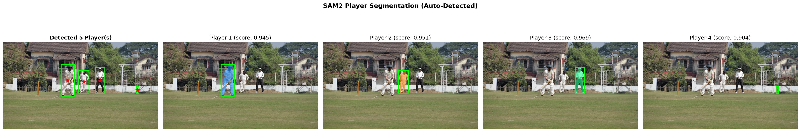

# Quick Start Guide

Get SAM2 training running in under 5 minutes.

## Prerequisites

- Docker with GPU support (`nvidia-docker`)
- ~2GB disk space for model checkpoints
- ~10GB disk space for training

## Steps

### 1. Download Checkpoints

```bash
cd checkpoints && ./download_ckpts.sh && cd ..
```

> This downloads SAM2.1 model weights (~1.5GB for base model).

### 2. Build Docker Image

```bash
docker build -t sam2-training -f Dockerfile.training .
```

### 3. Prepare Dataset

Your data must follow the SAM2 format:
```
dataset/
├── images/
│   └── video_name/
│       ├── 00000.jpg
│       └── 00001.jpg
└── masks/
    └── video_name/
        ├── 00000.png  # Grayscale, pixel=object_id
        └── 00001.png
```

**Converting from YOLO:**
```bash
python3 tools/yolo_to_sam2.py --input /path/to/yolo --output ./dataset
```

### 4. Run Training

```bash
./run_training_docker.sh
```

**With custom dataset:**
```bash
SAM2_DATASET=/data/my_dataset ./run_training_docker.sh
```

### 5. Monitor

Logs: `sam2_logs/custom_finetune/logs/`  
TensorBoard: `sam2_logs/custom_finetune/tensorboard/`  
Checkpoints: `sam2_logs/custom_finetune/checkpoints/`

```bash
tensorboard --logdir sam2_logs/custom_finetune/tensorboard
```

---

## 6. Run Inference (Auto-Detection)

After training, run inference with automatic player detection:

```bash
docker run --gpus all -v "$(pwd):/workspace" sam2-training \
    python3 tools/inference_auto_detect.py \
        --image dataset/test_frames/frame_01.jpg \
        --checkpoint sam2_logs/custom_finetune/checkpoints/checkpoint.pt \
        --output results/output.png
```

### Player Segmentation Result (10 Epochs, Auto-Detected)



> **Model Details:**  
> - Architecture: SAM2.1 Hiera B+  
> - Training: **10 epochs** on cricket player dataset  
> - Detection: Grounding DINO (automatic)
> - Mask scores: 0.88 - 0.97
>
> *Results will improve with extended training (50-100+ epochs) and larger datasets.*
